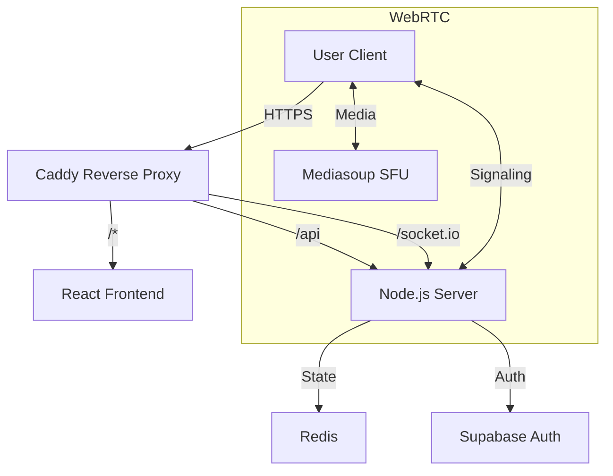

# Development Guide

## Prerequisites

- **Node.js**: v18 or higher
- **Docker**: Desktop or Engine (for containerized development)
- **Git**: For version control

## Project Structure

```
shareus-cloud-rooms/
├── src/                # Frontend source code (React)
│   ├── components/     # Reusable UI components
│   ├── contexts/       # React Contexts (WebSocket, Auth)
│   ├── hooks/          # Custom hooks
│   ├── lib/            # Utilities (Signaling, PeerManager)
│   └── pages/          # Application pages
├── server/             # Backend source code (Node.js)
│   ├── src/            # Server logic
│   └── Dockerfile      # Backend container definition
├── public/             # Static assets
├── .github/            # CI/CD workflows
├── docker-compose.yml  # Docker composition
└── README.md           # Project overview
```

## Getting Started

### 1. Environment Setup

Copy the example environment files:

```bash
# Frontend
cp .env.example .env

# Backend
cp server/.env.example server/.env
```

**Important**: Update `server/.env` with your local secrets. Do NOT commit `.env` files.

### 2. Running Locally (Without Docker)

You need two terminal instances.

**Terminal 1: Backend**
```bash
cd server
npm install
npm run dev
```
Server runs on `http://localhost:3001`.

**Terminal 2: Frontend**
```bash
npm install
npm run dev
```
Frontend runs on `http://localhost:5173`.

### 3. Running with Docker

```bash
docker-compose up --build
```
This spins up:
- Frontend
- Backend
- Redis
- Caddy (Reverse Proxy)

Access the app at `http://localhost`.

## Code Quality

We use ESLint and Prettier.

```bash
# Run linting
npm run lint

# Fix formatting
npm run format
```

Husky pre-commit hooks are configured to automatically lint staged files.

## Testing

Currently, we rely on manual verification and build checks.

```bash
# Verify build
npm run build
```

## Troubleshooting

- **WebSocket Errors**: Check if the backend is running and `VITE_WS_URL` matches the backend URL.

## Advanced Configuration

### TURN Server Setup

For production deployments, a TURN server is required to ensure connectivity behind firewalls/NATs.
See [docs/TURN_SETUP.md](docs/TURN_SETUP.md) for detailed instructions on setting up COTURN.

## Architecture



### Key Components

- **Frontend**: React + Vite + TailwindCSS. Uses `WebSocketContext` for global state and `useRoom` for room logic.
- **Backend**: Node.js + Express + Socket.IO. Handles signaling and room management.
- **SFU**: Mediasoup (integrated in backend) for selective forwarding unit capabilities.
- **State**: Redis for ephemeral room and participant data.
