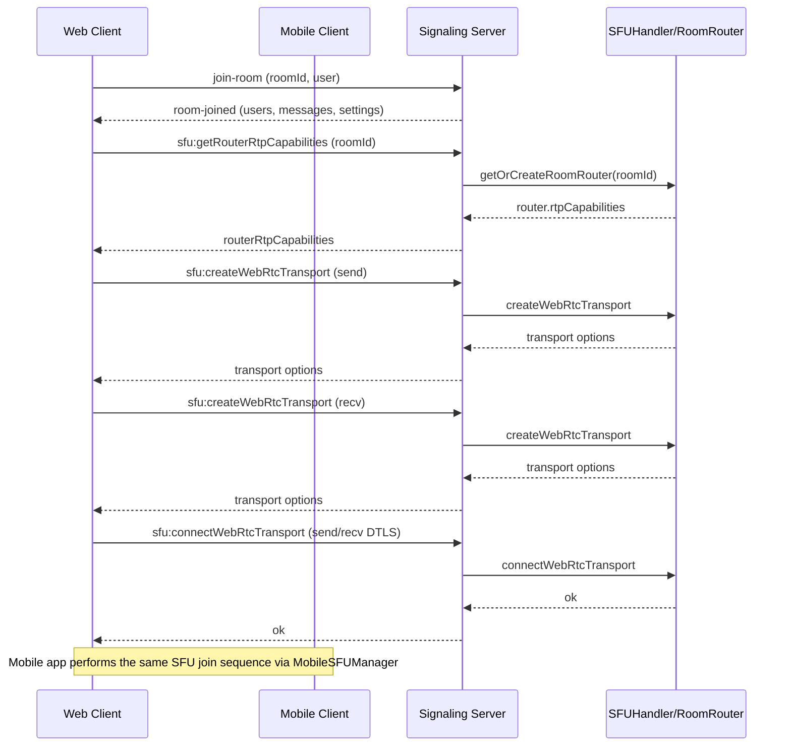
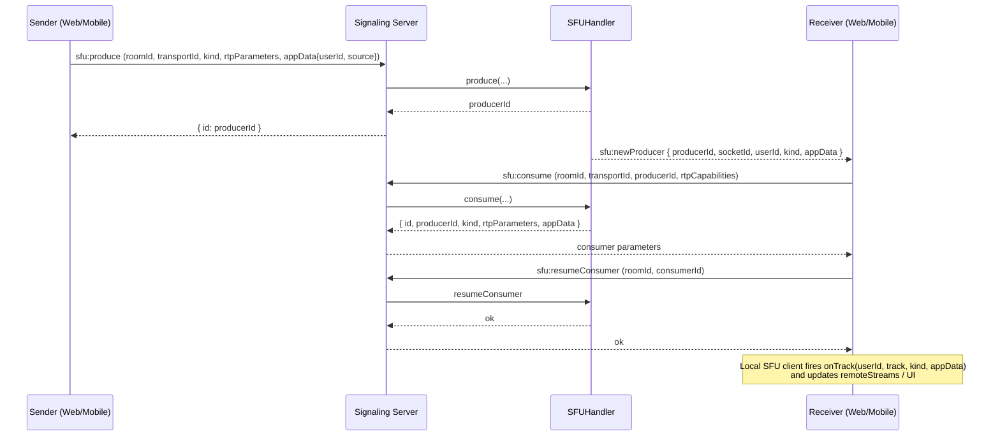

## Cospira Media Transmission (Audio & Video)

This document explains the **end-to-end flow** of audio/video between:

- **Web client** (React SPA)
- **Mobile client** (React Native app)
- **Signaling server** (Socket.IO)
- **SFU / mediasoup layer** (server-side)

It is focused only on **media (audio/video) capture, signaling, SFU routing, and rendering**, not on chat, games, or other features.

---

### 1. High-Level Architecture

- **Web / Mobile UI**
  - Capture local camera/microphone (`getUserMedia` / RN WebRTC).
  - Show local preview.
  - Display remote participants via `VideoGrid` / mobile equivalents.
  - Expose **Mic** and **Camera** toggle buttons.

- **Web / Mobile SFU Client**
  - Web: `SFUManager`
  - Mobile: `MobileSFUManager`
  - Handles mediasoup `Device`, send/recv transports, producers, and consumers.
  - Produces local tracks to the SFU and consumes remote tracks.

- **Signaling Server**
  - Socket.IO namespace that:
    - Manages rooms and users.
    - Broadcasts `user:media-state` (audio/video status).
    - Forwards SFU-related events to `SFUHandler`.

- **SFU / Mediasoup**
  - `SFUHandler` + `RoomRouter`
  - One mediasoup `Router` per room.
  - Per-peer transports, producers (outgoing media), and consumers (incoming media).
  - Broadcasts `sfu:newProducer` when a participant starts sending audio/video.

---

### 2. Join Room + SFU Setup Flow

#### 2.1 Sequence Diagram



#### 2.2 Key Responsibilities

- **Web**: `WebSocketContext` + `SFUManager.joinRoom(roomId, iceServers)`
- **Mobile**: `useWebSocket` + `mobileSFUManager.joinRoom(roomId)`
- **Server**: `SFUHandler`
  - `sfu:getRouterRtpCapabilities`
  - `sfu:createWebRtcTransport`
  - `sfu:connectWebRtcTransport`
  - `sfu:getProducers` (discover who is already sending media)

---

### 3. Local Media: Capture & Toggle Flow

Both web and mobile use **the same logical pattern**:

1. Capture local hardware (mic/camera) via `getUserMedia`.
2. Attach track(s) to a local `MediaStream` for preview.
3. Produce track(s) over the **send transport** to the SFU.
4. Emit `user:media-state` with `{ roomId, audio, video }` so others update UI.

#### 3.1 Web: Audio/Video Toggle Flow

- **Code paths**
  - `useMediaStream.ts` (`enableAudio`, `disableAudio`, `enableVideo`, `disableVideo`, `toggleAudio`, `toggleVideo`)
  - `SFUManager.produce / replaceTrack / pauseProducer / resumeProducer`
  - `WebSocketContext` and `useSocketEvents` listen for `user:media-state`.

```mermaid
flowchart TD
  A[User taps Mic/Camera button<br/>in web client] --> B{Currently enabled?}

  B -- "No (Enable)" --> C[Call getUserMedia<br/>(audio or video constraints)]
  C --> D[Attach track to local refs<br/>and update local preview stream]
  D --> E[SFUManager.replaceTrack or produce<br/>for 'mic' or 'webcam']
  E --> F[SFUManager.resumeProducer(source)]
  F --> G[Emit 'user:media-state'<br/>{ roomId, audio, video }]

  B -- "Yes (Disable)" --> H[Stop local track<br/>(track.stop())]
  H --> I[Update local preview stream]
  I --> J[SFUManager.pauseProducer(source)]
  J --> K[Emit 'user:media-state'<br/>{ roomId, audio, video }]
```

**Important notes (web):**

- Producers are **paused/resumed** for toggles, not destroyed.
- `user:media-state` is always emitted after state changes, keeping all clients in sync.

#### 3.2 Mobile: Audio/Video Toggle Flow (React Native)

- **Code paths**
  - `mobile-app/src/hooks/useWebSocket.js`
    - `toggleAudio`, `toggleVideo`
    - emits `user:media-state`
  - `mobile-app/src/services/MobileSFUManager.js`
    - `produce(track, source)`, `replaceTrack`, `closeProducer`

```mermaid
flowchart TD
  A[User taps Mic/Camera button<br/>in mobile app] --> B{Currently enabled?}

  B -- "No (Enable)" --> C[Check platform permissions<br/>(RECORD_AUDIO / CAMERA)]
  C --> D[mediaDevices.getUserMedia<br/>(AUDIO_CONSTRAINTS or VIDEO_CONSTRAINTS)]
  D --> E[Add track to local MediaStream<br/>and update local preview]
  E --> F[MobileSFUManager.produce(track, 'mic'/'webcam')]
  F --> G[Emit 'user:media-state'<br/>{ roomId, audio: true/false, video: true/false }]

  B -- "Yes (Disable)" --> H[Stop local track(s)<br/>and remove from stream]
  H --> I[MobileSFUManager.closeProducer('mic'/'webcam')]
  I --> J[Update local preview stream]
  J --> K[Emit 'user:media-state'<br/>{ roomId, audio: false or video: false }]
```

**Recent fixes (mobile):**

- `MobileSFUManager` now supports `setUserId(userId)` and includes `userId` in `appData`
  for `sfu:produce`, aligning with the web SFU client.
- `useWebSocket` calls `mobileSFUManager.setUserId(joinedAsUserId)` after join,
  so SFU and room user IDs stay consistent.

---

### 4. SFU Routing & Remote Subscription Flow

When any participant starts sending media, the SFU notifies all others.

#### 4.1 Server SFU Events

- **Produce**
  - Event: `sfu:produce`
  - Handler: `SFUHandler` → `RoomRouter.produce`
  - Side effects:
    - Adds producer to room.
    - Emits `sfu:newProducer` to all other sockets in the room.

- **Consume**
  - Event: `sfu:consume`
  - Handler: `SFUHandler` → `RoomRouter.consume`
  - Returns:
    - `id`, `producerId`, `kind`, `rtpParameters`, `appData`

- **Resume consumer**
  - Event: `sfu:resumeConsumer`
  - Handler resumes the consumer on the server so packets start flowing.

- **New explicit close handlers (cleanup)**
  - `sfu:closeProducer` → closes a mediasoup producer and updates peer state.
  - `sfu:closeConsumer` → closes a mediasoup consumer when the client cannot or will not consume it.

#### 4.2 Remote Subscription Flow



#### 4.3 Client-Side Handling

- **Web**
  - `useSocketEvents` handles `sfu:newProducer` and calls `SFUManager.consume`.
  - `SFUManager.onTrack` callback updates `remoteStreams` in `WebSocketContext`.
  - `VideoGrid` + `VideoTile` render video and play audio.

- **Mobile**
  - `useWebSocket` handles `sfu:newProducer` and calls `mobileSFUManager.consume`.
  - `MobileSFUManager.onTrack` callback updates `remoteStreams` Map.
  - React Native UI attaches each `MediaStream` to the appropriate video/audio view.

---

### 5. Media State Synchronization (`user:media-state`)

Media state synchronization ensures **toggles and UI indicators** stay correct across all clients.

#### 5.1 Server: `user:media-state` Handling

- File: `server/src/sockets/rooms.socket.js`
- Event: `user:media-state` (from any client)
  - Payload: `{ roomId, audio?: boolean, video?: boolean }`
  - Server:
    - Resolves logical `userId` using `socket.id` and `room.users[]`.
    - Updates room user record (`audio`, `video`, `isMuted`, `isVideoOn`).
    - Persists in Redis.
    - Broadcasts:
      - `user:media-state` → `{ userId, audio, video }` to **other clients**.

#### 5.2 Web Client: Listening & UI Update

- Files:
  - `src/contexts/WebSocket/useSocketEvents.ts`
  - `src/contexts/WebSocketContext.tsx`

- Behavior:
  - Listens for `user:media-state`.
  - Updates `users[]`:
    - `isMuted = !audio` (if `audio` provided).
    - `isVideoOn = video` (if `video` provided).
  - `VideoGrid` then uses `isMuted` / `isVideoOn` to drive:
    - Mute icons.
    - Whether to show avatar vs video feed.

#### 5.3 Mobile Client: Listening & UI Update (FIXED)

- File: `mobile-app/src/hooks/useWebSocket.js`

- Behavior:
  - Now subscribes to `user:media-state`:
    - `socketService.on('user:media-state', onUserMediaState)`
  - Updates each `user` object:
    - `isMuted = !audio` when `audio` is defined.
    - `isVideoOn = video` when `video` is defined.
  - Ensures that when a web user or another mobile user mutes/unmutes / turns camera on/off,
    the **mobile app immediately reflects that state correctly**.

---

### 6. Cleanup & Close Flows

Proper cleanup is critical for stability at large scale.

#### 6.1 Client-Side Cleanup

- **Web** (`SFUManager.closeAll` and `leaveRoom`):
  - Closes all producers and consumers.
  - Closes send/recv transports.
  - Clears `remoteStreams` and `localStream`.

- **Mobile**
  - `MobileSFUManager.closeAll()`:
    - Closes all producers/consumers/transports.
  - `useWebSocket` effect cleanup:
    - Unsubscribes all socket listeners.
    - Calls `socketService.leaveRoom(roomId)`.

#### 6.2 Server-Side Cleanup

- **Peer disconnect / leave-room**
  - `SFUHandler.cleanupPeer(socket.id, roomId)` via `RoomRouter.removePeer`.
  - Closes:
    - All transports for that peer.
    - All associated producers and consumers.
  - Optionally tears down the room SFU router when the room is empty.

- **Explicit producer/consumer close (new handlers)**
  - `sfu:closeProducer`:
    - Closes a specific producer.
    - Updates `peerStates.producerIds`.
  - `sfu:closeConsumer`:
    - Closes a specific consumer if a client cannot consume it.
    - Updates `peerStates.consumerIds`.

---

### 7. End-to-End Reliability Checklist

To support very high concurrency (tens of millions of users over time), the media layer follows these principles:

- **Single source of truth for media state**: `user:media-state` events and room records in Redis.
- **Stable user identity across layers**:
  - Web: `SFUManager.setUserId(user.id)` attaches `userId` to all producers.
  - Mobile: `mobileSFUManager.setUserId(joinedAsUserId)` does the same.
- **Graceful toggling**:
  - Web uses **pause/resume** on producers.
  - Mobile uses close/re-produce but always syncs with `user:media-state`.
- **Explicit cleanup APIs**:
  - `sfu:closeProducer` and `sfu:closeConsumer` avoid leaking server-side mediasoup resources.
- **Defensive consumption**:
  - Clients check transports and capabilities before consuming.
  - If they cannot consume a producer, they request the server to close the consumer.

If you extend or modify audio/video behavior, keep it aligned with this workflow so that **all clients (web + mobile)** stay perfectly in sync.

