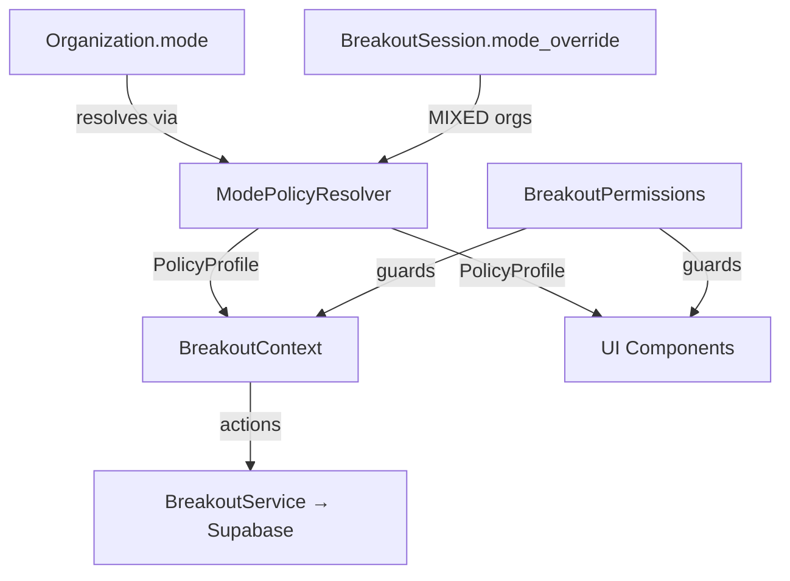

# Organization + Breakout System — Walkthrough

## What Was Built

A complete, governance-first **Organization & Breakout Session system** where all behavior is derived from a centralized [ModePolicyResolver](file:///c:/Users/mahes/Downloads/PROJECTS/COSPIRA_PROJECT/COSPIRA_MAIN/src/lib/ModePolicyResolver.ts#125-199) — not scattered per-screen [if](file:///c:/Users/mahes/Downloads/PROJECTS/COSPIRA_PROJECT/COSPIRA_MAIN/src/pages/JoinOrganization.tsx#37-55) statements.

---

## Architecture



---

## Files Created / Modified

### New Core Types & Contracts
| File | What it does |
|------|-------------|
| [organization.ts](file:///c:/Users/mahes/Downloads/PROJECTS/COSPIRA_PROJECT/COSPIRA_MAIN/src/types/organization.ts) | Added [OrgMode](file:///c:/Users/mahes/Downloads/PROJECTS/COSPIRA_PROJECT/COSPIRA_MAIN/src/types/organization.ts#4-5), [OrgStatus](file:///c:/Users/mahes/Downloads/PROJECTS/COSPIRA_PROJECT/COSPIRA_MAIN/src/types/organization.ts#5-6), [BreakoutStatus](file:///c:/Users/mahes/Downloads/PROJECTS/COSPIRA_PROJECT/COSPIRA_MAIN/src/types/organization.ts#6-7), [BreakoutRole](file:///c:/Users/mahes/Downloads/PROJECTS/COSPIRA_PROJECT/COSPIRA_MAIN/src/types/organization.ts#7-8), [BreakoutSession](file:///c:/Users/mahes/Downloads/PROJECTS/COSPIRA_PROJECT/COSPIRA_MAIN/src/types/organization.ts#94-108), [BreakoutParticipant](file:///c:/Users/mahes/Downloads/PROJECTS/COSPIRA_PROJECT/COSPIRA_MAIN/src/types/organization.ts#109-122), [UserPresence](file:///c:/Users/mahes/Downloads/PROJECTS/COSPIRA_PROJECT/COSPIRA_MAIN/src/types/organization.ts#126-133) |
| [breakout-events.ts](file:///c:/Users/mahes/Downloads/PROJECTS/COSPIRA_PROJECT/COSPIRA_MAIN/src/types/breakout-events.ts) | WebSocket event envelope + all typed event payloads |

### Policy Engine
| File | What it does |
|------|-------------|
| [ModePolicyResolver.ts](file:///c:/Users/mahes/Downloads/PROJECTS/COSPIRA_PROJECT/COSPIRA_MAIN/src/lib/ModePolicyResolver.ts) | **Single source of truth** for FUN/PROF/ULTRA_SECURE policies |
| [BreakoutPermissions.ts](file:///c:/Users/mahes/Downloads/PROJECTS/COSPIRA_PROJECT/COSPIRA_MAIN/src/lib/BreakoutPermissions.ts) | Centralized permission checks (canCreate, canStart, canEnter, etc.) |

### Data Layer
| File | What it does |
|------|-------------|
| [BreakoutService.ts](file:///c:/Users/mahes/Downloads/PROJECTS/COSPIRA_PROJECT/COSPIRA_MAIN/src/services/BreakoutService.ts) | All Supabase CRUD: create/assign/start/close breakouts |
| [BreakoutContext.tsx](file:///c:/Users/mahes/Downloads/PROJECTS/COSPIRA_PROJECT/COSPIRA_MAIN/src/contexts/BreakoutContext.tsx) | React context: state + actions, derives `effectiveMode` + `policy` |

### App Integration
| File | Change |
|------|--------|
| [App.tsx](file:///c:/Users/mahes/Downloads/PROJECTS/COSPIRA_PROJECT/COSPIRA_MAIN/src/App.tsx) | Added `<BreakoutProvider>` inside `<OrganizationProvider>` |
| [AnimatedRoutes.tsx](file:///c:/Users/mahes/Downloads/PROJECTS/COSPIRA_PROJECT/COSPIRA_MAIN/src/components/AnimatedRoutes.tsx) | Added 3 new lazy-loaded protected routes |

### Pages
| Route | File |
|-------|------|
| `/organizations` | [Organizations.tsx](file:///c:/Users/mahes/Downloads/PROJECTS/COSPIRA_PROJECT/COSPIRA_MAIN/src/pages/Organizations.tsx) |
| `/organizations/:orgId/room` | [OrganizationRoom.tsx](file:///c:/Users/mahes/Downloads/PROJECTS/COSPIRA_PROJECT/COSPIRA_MAIN/src/pages/OrganizationRoom.tsx) |
| `/organizations/:orgId/breakout/:breakoutId` | [BreakoutRoom.tsx](file:///c:/Users/mahes/Downloads/PROJECTS/COSPIRA_PROJECT/COSPIRA_MAIN/src/pages/BreakoutRoom.tsx) |

---

## Mode Behavior Matrix

| Capability | 🟢 FUN | 🔵 PROF | 🔴 ULTRA SECURE | 🟣 MIXED |
|---|---|---|---|---|
| Participant self-move | ✓ | ✗ | ✗ | Per breakout |
| Host can reassign | ✓ | ✗ | ✗ | Per breakout |
| Owner silent join | ✓ | ✓ | ✗ (visible) | Per breakout |
| Mandatory recording | ✗ | ✗ | ✓ | Per breakout |
| Identity enforced | ✗ | ✓ | ✓ | Per breakout |
| Nicknames allowed | ✓ | ✗ | ✗ | Per breakout |
| Reactions panel | ✓ | ✗ | ✗ | ✗ |
| Compliance banner | ✗ | ✗ | ✓ | ✗ |

---

## What's Pending (Manual Steps)

> [!IMPORTANT]
> These must be applied in Supabase before breakouts will work end-to-end.

**1. Add `mode` column to `organizations`:**
```sql
ALTER TABLE organizations 
ADD COLUMN mode text NOT NULL DEFAULT 'FUN' 
CHECK (mode IN ('FUN', 'PROF', 'ULTRA_SECURE', 'MIXED'));
```

**2. Create `breakout_sessions` table:**
```sql
CREATE TABLE breakout_sessions (
  id uuid PRIMARY KEY DEFAULT gen_random_uuid(),
  organization_id uuid NOT NULL REFERENCES organizations(id) ON DELETE CASCADE,
  name text NOT NULL,
  host_id uuid REFERENCES auth.users(id),
  status text NOT NULL DEFAULT 'CREATED' CHECK (status IN ('CREATED', 'LIVE', 'CLOSED')),
  mode_override text CHECK (mode_override IN ('FUN', 'PROF', 'ULTRA_SECURE')),
  max_participants integer NOT NULL DEFAULT 20,
  created_at timestamptz DEFAULT now()
);
```

**3. Create `breakout_participants` table:**
```sql
CREATE TABLE breakout_participants (
  id uuid PRIMARY KEY DEFAULT gen_random_uuid(),
  breakout_id uuid NOT NULL REFERENCES breakout_sessions(id) ON DELETE CASCADE,
  user_id uuid NOT NULL REFERENCES auth.users(id),
  role text NOT NULL DEFAULT 'PARTICIPANT' CHECK (role IN ('HOST', 'PARTICIPANT')),
  joined_at timestamptz DEFAULT now(),
  UNIQUE (breakout_id, user_id)
);
```

**4. Server-side Socket.IO handlers** for breakout events (separate delivery).

---

## Validation

- ✅ TypeScript build passes with no errors on all new files
- ✅ `ModePolicyResolver.getBadge()`, [getPolicy()](file:///c:/Users/mahes/Downloads/PROJECTS/COSPIRA_PROJECT/COSPIRA_MAIN/src/lib/ModePolicyResolver.ts#145-166), [resolveEffectiveMode()](file:///c:/Users/mahes/Downloads/PROJECTS/COSPIRA_PROJECT/COSPIRA_MAIN/src/lib/ModePolicyResolver.ts#126-144) verified present
- ✅ All 3 routes protected with `<ProtectedRoute>`
- ✅ [BreakoutProvider](file:///c:/Users/mahes/Downloads/PROJECTS/COSPIRA_PROJECT/COSPIRA_MAIN/src/contexts/BreakoutContext.tsx#41-181) properly nested inside [OrganizationProvider](file:///c:/Users/mahes/Downloads/PROJECTS/COSPIRA_PROJECT/COSPIRA_MAIN/src/contexts/OrganizationContext.tsx#23-142)
- ✅ No cross-component policy logic — everything derives from [ModePolicyResolver](file:///c:/Users/mahes/Downloads/PROJECTS/COSPIRA_PROJECT/COSPIRA_MAIN/src/lib/ModePolicyResolver.ts#125-199)
